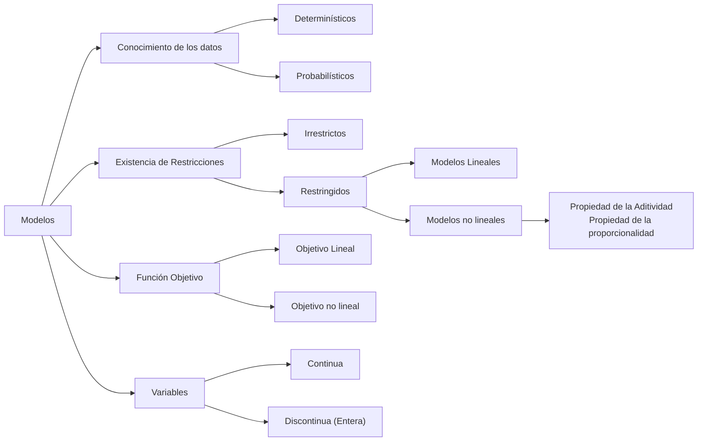

---
{"dg-publish":true,"permalink":"/uaslp/2026-b/58-modelado-matematico/58-1-primer-parcial/58-1-9-1-identificacion-de-variables-de-decision/","dgHomeLink":true,"dgShowBacklinks":true,"dgShowLocalGraph":true,"dgShowGraphDepthControl":true,"dgShowInlineTitle":true,"dgShowFileTree":true,"dgEnableSearch":true,"dgShowToc":true,"dgLinkPreview":true,"dgShowTags":true,"dg-note-properties":{}}
---

Consiste en definir las incógnitas del problema. Son las decisiones que debes tomar y sobre las cuales tienes control. Por ejemplo: ¿Cuántas unidades de un producto fabricar? o ¿Qué cantidad de dinero invertir?

>[!QUOTE]
>"Son aquellas que cuando se determine su valor seran la respuestas al problema"

Es **necesario** nombrar a cada una de estas variables
Se puede hacer por medio de nemotecnicos
O utilizar las letras x, y y z con subindices

> [!Note]
> Lo mas comun es utilizar *x* con subindices
> La *y* se utiliza para variables dicotomicas

>[!Warning]
>Nunca utilizar *z*, tiene otro significado

