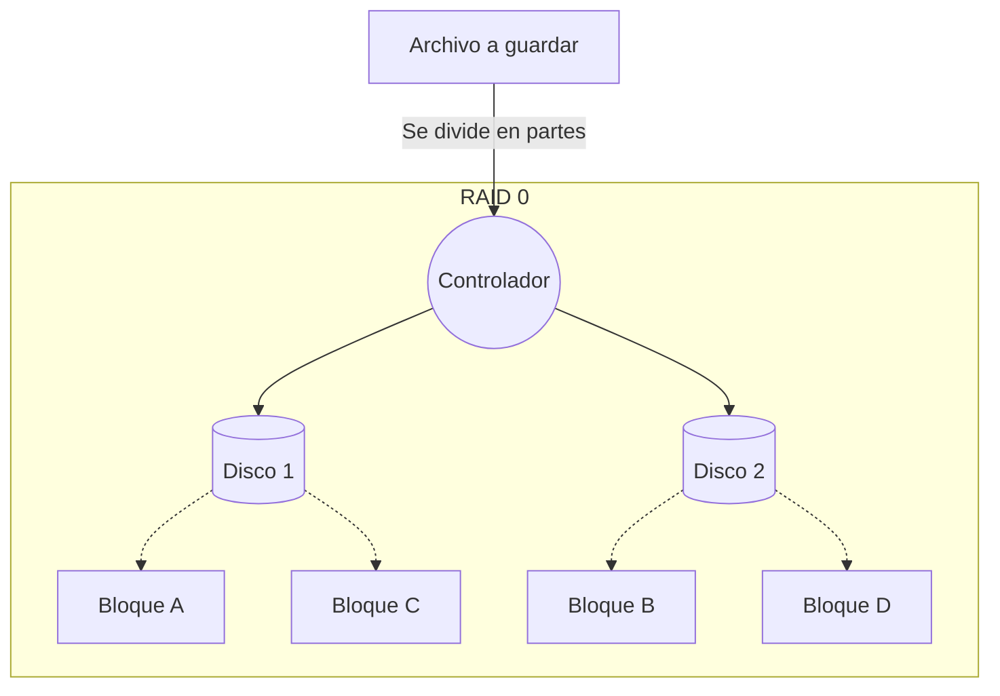
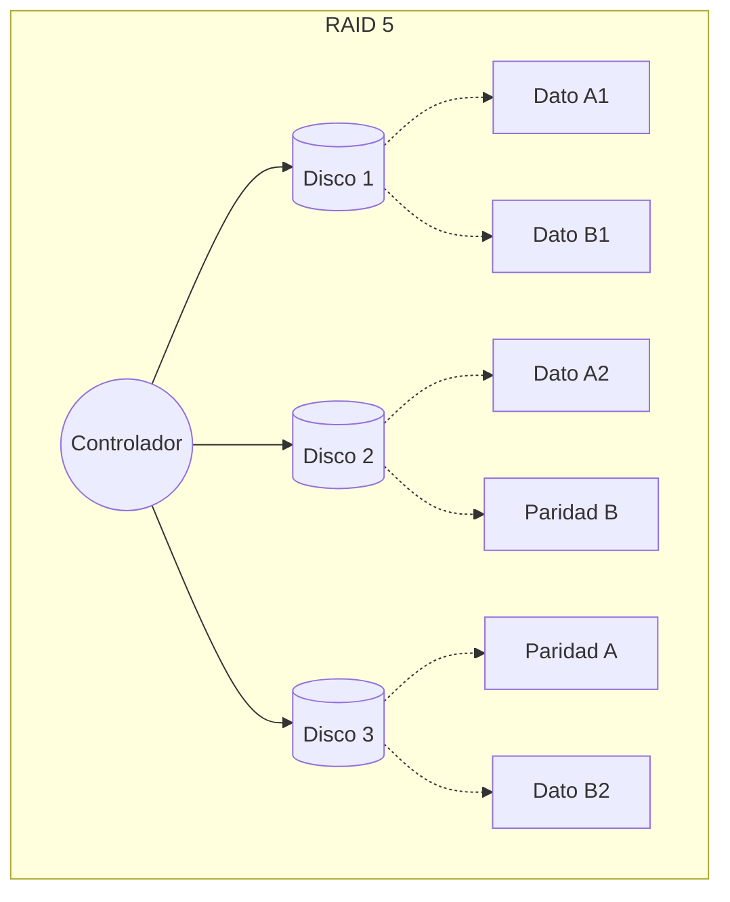
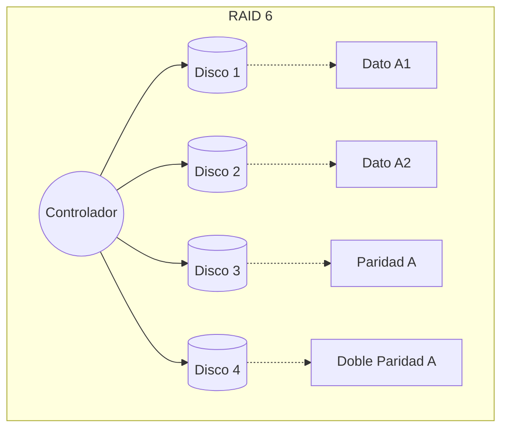
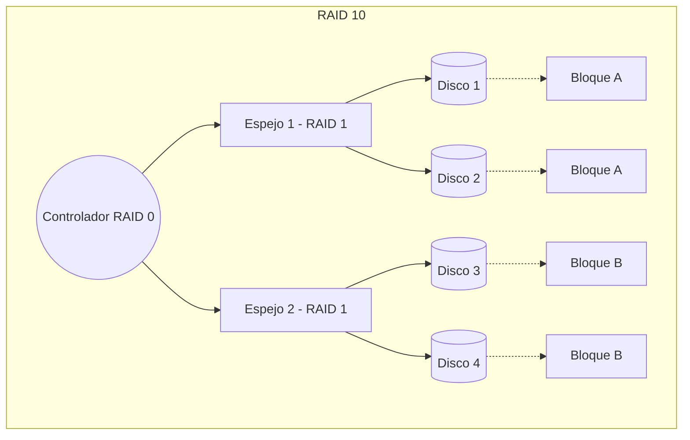

---
{"dg-publish":true,"permalink":"/uaslp/2026-b/59-bases-de-datos/actividades/actividad-1/","dgHomeLink":true,"dgShowBacklinks":true,"dgShowLocalGraph":true,"dgShowGraphDepthControl":true,"dgShowInlineTitle":true,"dgShowFileTree":true,"dgEnableSearch":true,"dgShowToc":true,"dgLinkPreview":true,"dgShowTags":true,"dg-note-properties":{}}
---

Universidad Autónoma de San Luis Potosí 

Facultad de Ingeniería 

Área de Ciencias de la Computación 

Alejandro Melo Flores

Bases de Datos

Alberto Ramos Blanco 

Nombre de la actividad: “Investigación sobre niveles de RAID” 

Fecha de entrega: 30 de agosto de 2026 

Semestre: 2026-2027/I 

--- 

### ¿Qué es RAID y por qué es importante?
RAID (*Redundant Array of Independent Disks*) es una tecnología que agrupa varios discos físicos para que el sistema operativo los vea como una sola unidad lógica. Es fundamental porque permite mejorar el rendimiento (velocidad de lectura/escritura), proporcionar tolerancia a fallos (redundancia para no perder datos si un disco se descompone), o ambas cosas al mismo tiempo.

---
### Desarrollo
RAID 0 (Striping)
   * **Mínimo de discos:** 2
   * **¿Qué pasa si un disco falla?** Se pierde toda la información del arreglo.
   * **¿Tiene buena velocidad?** Excelente. Al dividir los datos (striping), lee y escribe en los discos en paralelo.
   * **Uso recomendado:** Edición de video o unidades de caché donde importa más la velocidad bruta que la seguridad.
   * **Esquema digital:** Bloques de datos divididos y alternados linealmente (Ej. el Dato 1 se guarda en el Disco A y el Dato 2 en el Disco B).
 * **RAID 1 (Mirroring)**
   * **Mínimo de discos:** 2
   * **¿Qué pasa si un disco falla?** No pasa nada; el otro disco conserva una copia exacta.
   * **¿Tiene buena velocidad?** Buena velocidad de lectura (lee de ambos), pero escritura normal (debe escribir lo mismo en ambos).
   * **Uso recomendado:** Sistemas contables o datos críticos en pequeñas empresas.
   * **Esquema digital:** Copia espejo (Ej. el Dato 1 se copia idéntico en el Disco A y en el Disco B)

RAID 5 (Striping con paridad distribuida)
* **Mínimo de discos:** 3
* **¿Qué pasa si un disco falla?** El sistema sigue funcionando y los datos perdidos se reconstruyen usando los "bloques de paridad" de los discos restantes.
* **¿Tiene buena velocidad?** Lectura rápida, pero escritura moderada, ya que necesita realizar cálculos matemáticos para guardar la paridad
* **Uso recomendado:** Servidores de archivos empresariales y almacenamiento general
* **Esquema digital:** Datos repartidos entre los discos, con un bloque de paridad que va rotando de disco en cada fila de datos

mano):

**RAID 6 (Striping con doble paridad)**
* **Mínimo de discos:** 4
* **¿Qué pasa si un disco falla?** Soporta el fallo de hasta **2 discos al mismo tiempo** sin perder información
* **¿Tiene buena velocidad?** Lectura rápida, pero escritura un poco más lenta que RAID 5 por el cálculo de la doble paridad
* **Uso recomendado:** Bases de datos críticas y arreglos de almacenamiento grandes.
* **Esquema digital:** Similar a RAID 5, pero en cada fila de datos se calculan y guardan dos bloques de paridad distintos

**RAID 10 (RAID 1 + RAID 0)**
* **Mínimo de discos:** 4 (en pares)
* **¿Qué pasa si un disco falla?** Soporta la falla de un disco por cada subgrupo de discos en espejo
* **¿Tiene buena velocidad?** Excelente tanto en lectura como en escritura, ya que no pierde tiempo calculando paridades.
* **Uso recomendado:** Servidores web de alto tráfico, bases de datos intensivas y correos corporativos
* **Esquema digital:** Dos subgrupos de RAID 1 (espejo) conectados por un controlador principal que hace un RAID 0 (striping) entre ellos

---

## Conclusión
**¿Cuál nivel RAID consideras más útil para guardar información importante y por qué?**
Para bases de datos de alta demanda, **RAID 10** es el más útil porque ofrece redundancia inmediata sin penalizar el rendimiento. Sin embargo, para almacenamiento masivo puro donde la tolerancia a fallos catastróficos es la prioridad número uno, **RAID 6** es excelente porque garantiza que los datos sobrevivan incluso si fallan dos discos simultáneamente durante una reconstrucción.

---

## Bibliografía
 * Nurmala, I. (2018, 7 de junio). *RAID technology (data storage virtualization)*. Medium. https://medium.com/@ichanurmala23/raid-technology-data-storage-virtualization-cc80de479f71
 * Porter, J. J. (s.f.). *RAID levels explained: RAID 0, 1, 5, 6, and 10*. Liquid Web. Recuperado el 27 de agosto de 2026, de https://www.liquidweb.com/blog/raid-level-1-5-6-10/
